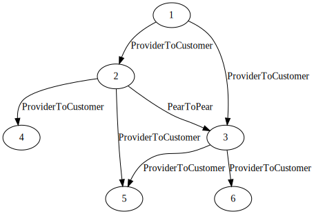
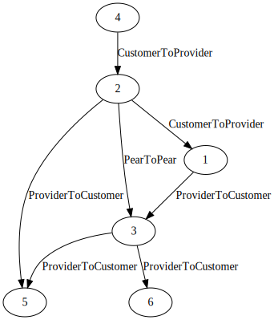

# Valley Free Graph

**Merged to [bgpkit/valley-free](https://github.com/bgpkit/valley-free)**

This crate analyses the AS relationship as a [petgraph](https://docs.rs/petgraph/latest/petgraph/index.html) graph, 
generating a path DAG based on a valley-free model.

The normal topology has no acyclic guarantees



But after transforming it into a path graph you will have a DAG from the source AS to all others AS.



And then you can use this DAG with all the classic graph methods to analyze it.
For example, you can find the [length of all shortest paths](https://docs.rs/petgraph/latest/petgraph/algo/k_shortest_path/fn.k_shortest_path.html),
or even [all the paths](https://docs.rs/petgraph/latest/petgraph/algo/simple_paths/fn.all_simple_paths.html).

## Install
This library is not on crates.io yet, so you need to install it from GitHub.
```tolm
valley-free-graph = { git = "https://github.com/guissalustiano/valley-free-graph.git" }
```

## Examples
To use the examples expect the [CAIDA-as 2023-12-01 dataset](https://publicdata.caida.org/datasets/as-relationships/serial-1/20231201.as-rel.txt.bz2)
on the root directory.

The examples are available in the [`examples/`](examples/) direction.

You can run it with `cargo run --example=<filename without .rs>`.

## References
This library is highly inspired by [valley-free from bgpkit](https://github.com/bgpkit/valley-free),
but try to return a subset of all paths instead, return the whole graph, and do what you want with 
that using all the power of graph libraries.
